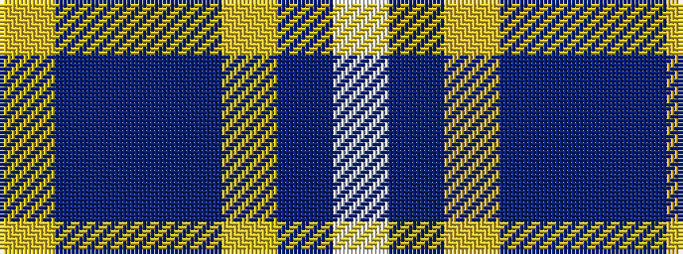

WBYBBBY

It is a 7 stripe tartan.

<figure class="pat-woven">

<figcaption>idealised sample</figcaption>
</figure>

## Colour Sequence



## Tartans with this colour sequence

| Tartans |
|---------------|
| [Mina Perhonen Japanese Corporate Tartan](/variants/s7/w4db24ly2dbi24t5db4ly4~x2/)|
||
