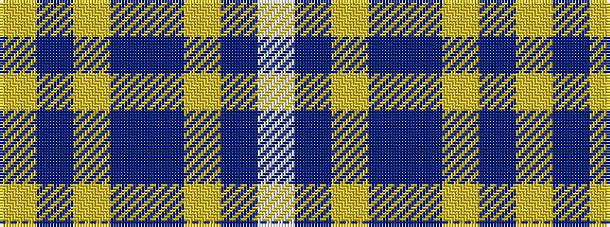

WBYBBYBY

It is a 8 stripe tartan.

<figure class="pat-woven">

<figcaption>idealised sample</figcaption>
</figure>

## Colour Sequence



## Tartans with this colour sequence

| Tartans |
|---------------|
| [Halesowen #2](/variants/s8/w9db3ly3db24dt24ly2dt2ly2~x2/)|
||
| [Halesowen (District)](/variants/s8/w9b3ly3b24db24ly2db2ly2~x2/)|
||
