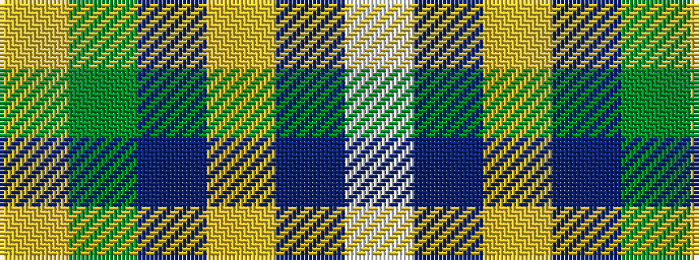

WBYBGY

It is a 6 stripe tartan.

<figure class="pat-woven">

<figcaption>idealised sample</figcaption>
</figure>

## Colour Sequence



## Tartans with this colour sequence

| Tartans |
|---------------|
| [Tartan Lassie (Fashion)](/setts/s6/w3b23lr44b26g4ly2~x2/)|
||
