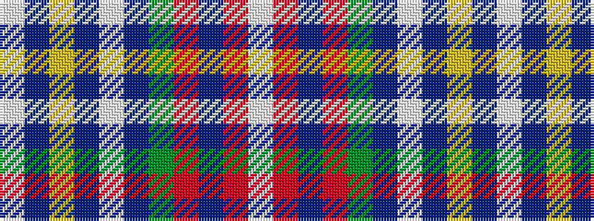

WBYBWBGRBRW

It is a 11 stripe tartan.

<figure class="pat-woven">

<figcaption>idealised sample</figcaption>
</figure>

## Colour Sequence



## Tartans with this colour sequence

| Tartans |
|---------------|
| [Stewart dress, Blue](/variants/s11/w72db20ly2db3w2db3y16o6db2o5w2~x2/)|
||
