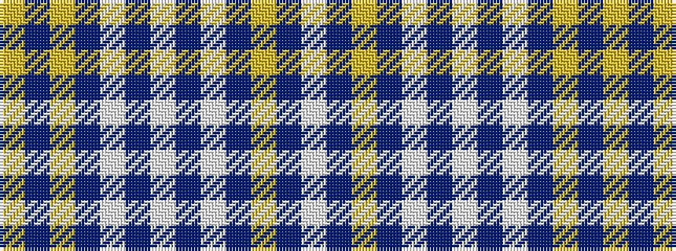

WBYBWBWBWBYBY

It is a 13 stripe tartan.

<figure class="pat-woven">

<figcaption>idealised sample</figcaption>
</figure>

## Colour Sequence



## Tartans with this colour sequence

| Tartans |
|---------------|
| [Delta Dental Association](/setts/s13/wi4n1lr29n6w13n13w6n13w13n6lr29n1lg4~x2/)|
||
