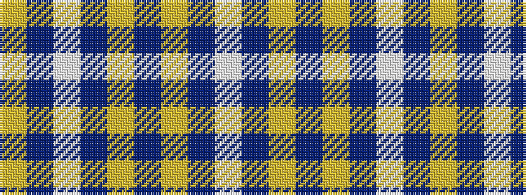

WBYBYBWBY

It is a 9 stripe tartan.

<figure class="pat-woven">

<figcaption>idealised sample</figcaption>
</figure>

## Colour Sequence



## Tartans with this colour sequence

| Tartans |
|---------------|
| [Centrica Energy](/setts/s9/w12db79lo6db53lgi4db22lp10db24lg8/)|
||
