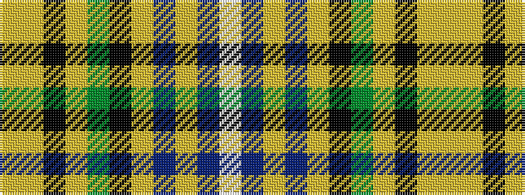

WBYBYKGYKYY

It is a 11 stripe tartan.

<figure class="pat-woven">

<figcaption>idealised sample</figcaption>
</figure>

## Colour Sequence



## Tartans with this colour sequence

| Tartans |
|---------------|
| [Cossar (Personal)](/variants/s11/w4t5lo3t22ly4k3g16lo7k2lo7ly2~x2/)|
||
