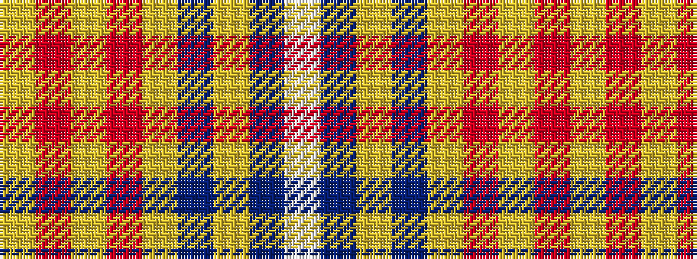

WBYBYRYRY

It is a 9 stripe tartan.

<figure class="pat-woven">

<figcaption>idealised sample</figcaption>
</figure>

## Colour Sequence



## Tartans with this colour sequence

| Tartans |
|---------------|
| [Canuck Place](/variants/s9/w1db2lg15db3lg26o24lg3r2lo1~x2/)|
||
