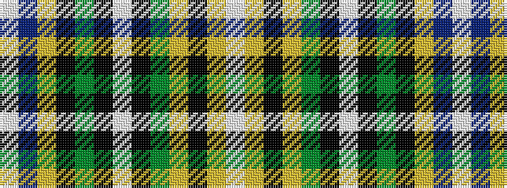

WBYKGKWKGYKYW

It is a 13 stripe tartan.

<figure class="pat-woven">

<figcaption>idealised sample</figcaption>
</figure>

## Colour Sequence



## Tartans with this colour sequence

| Tartans |
|---------------|
| [Bowling Irish Family Tartan](/variants/s13/w2ly3k2ly6g8k2w2k2g2k6ly3db14w1~x2/)|
||
