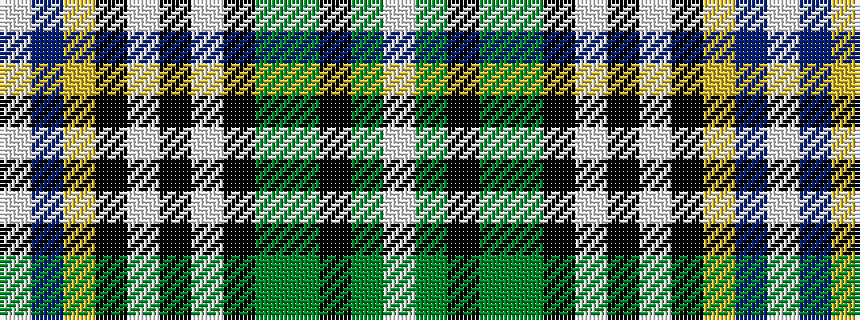

WBYKWKWKGGKGW

It is a 13 stripe tartan.

<figure class="pat-woven">

<figcaption>idealised sample</figcaption>
</figure>

## Colour Sequence



## Tartans with this colour sequence

| Tartans |
|---------------|
| [Clodagh Cork Irish District Tartan Tartan Number: 1795. Earliest known date: 1970 In a letter from a Northern Irish bagpipe maker in 1979 it says, '...it has been established that it originated somewhere in the Bog of Allen in Southern Ireland.' However, there is a marked similarity with the King George VI tartan which is a variation of the Royal Stewart. There is also a similarity with the MacBeth tartan. See products available Copyright © Blair Urquhart, Comrie, 2015](/setts/s13/w3db20ly4k9w3k3w3k3g14dy9k3dy4w3~x2/)|
||
| [Clodagh/Cork](/setts/s13/w4dy4k3dy9dg13k3w3k3w3k9ly4n20w3~x2/)|
||
