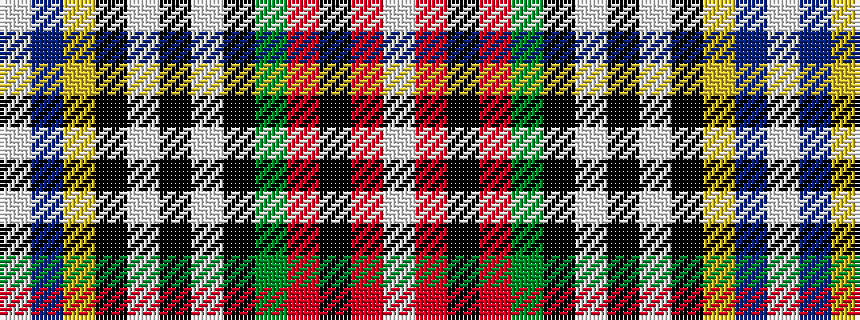

WBYKWKWKGRKRW

It is a 13 stripe tartan.

<figure class="pat-woven">

<figcaption>idealised sample</figcaption>
</figure>

## Colour Sequence



## Tartans with this colour sequence

| Tartans |
|---------------|
| [Clodagh, Cork](/setts/s13/w3db20ly4k9w3k3w3k3g14o9k3o4w3~x2/)|
||
