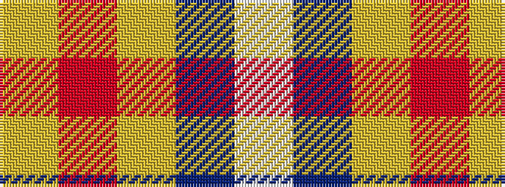

WBYRY

It is a 5 stripe tartan.

<figure class="pat-woven">

<figcaption>idealised sample</figcaption>
</figure>

## Colour Sequence



## Tartans with this colour sequence

| Tartans |
|---------------|
| [Tailor Ishida, Kobe](/setts/s5/lg25r1ly1n9w4~x2/)|
||
