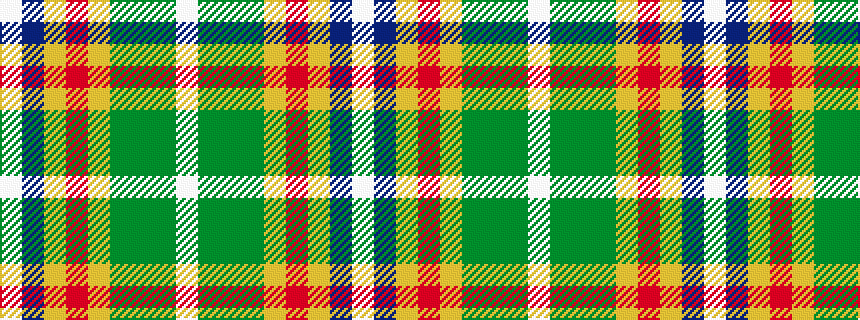

WBYRYGGGW

It is a 9 stripe tartan.

<figure class="pat-woven">

<figcaption>idealised sample</figcaption>
</figure>

## Colour Sequence



## Tartans with this colour sequence

| Tartans |
|---------------|
| [Kleto, Susan (Personal)](/setts/s9/w1dt16lo1r3lo1dg6y2dg6w1~x2/)|
||
| [Kleto, Susan (Personal)](/setts/s9/w1db16ly1r3ly1gi6g2gi6w1~x2/)|
||
