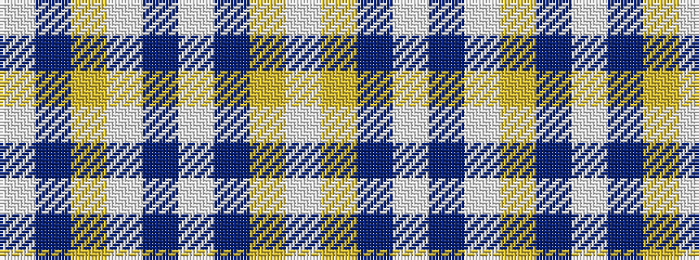

WBYWBWBYW

It is a 9 stripe tartan.

<figure class="pat-woven">

<figcaption>idealised sample</figcaption>
</figure>

## Colour Sequence



## Tartans with this colour sequence

| Tartans |
|---------------|
| [Silver (Personal)](/variants/s9/w24b24lr6w1db4w20b10lr3w4~x2/)|
||
