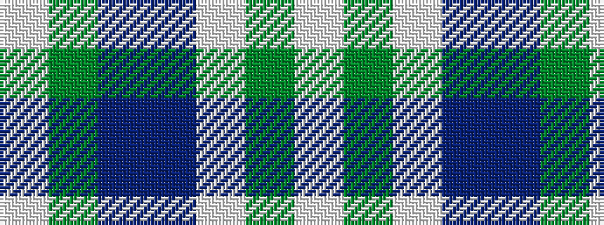

WGBBWGW

It is a 7 stripe tartan.

<figure class="pat-woven">

<figcaption>idealised sample</figcaption>
</figure>

## Colour Sequence



## Tartans with this colour sequence

| Tartans |
|---------------|
| [Shiel, Purple (Dance)](/variants/s7/w8g5t10dp24w30g2lp2~x2/)|
||
| [Shiel, Purple V2 (Dance)](/variants/s7/w8g5dp10t24w30g2lp2~x2/)|
||
