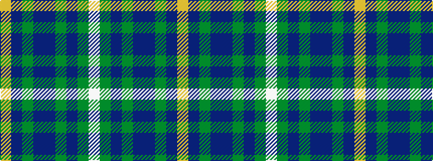

WGBGBBGBY

It is a 9 stripe tartan.

<figure class="pat-woven">

<figcaption>idealised sample</figcaption>
</figure>

## Colour Sequence



## Tartans with this colour sequence

| Tartans |
|---------------|
| [Scottish Borderland (Fashion)](/variants/s9/lb2dg2ni1dg30n10ni20dg1ni2lo1~x2/)|
||
