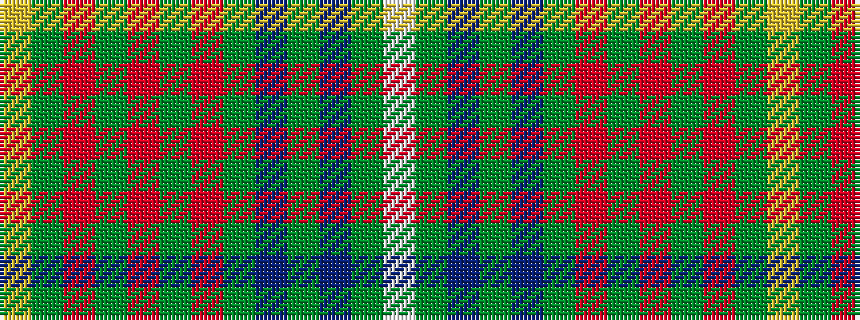

WGBGBGRGRGRGY

It is a 13 stripe tartan.

<figure class="pat-woven">

<figcaption>idealised sample</figcaption>
</figure>

## Colour Sequence



## Tartans with this colour sequence

| Tartans |
|---------------|
| [Glencross (Kirkbampton) (Personal)](/variants/s13/w3dg35db3dg2db3dg10r3dg2r3dg2r3dg10lo2~x2/)|
||
