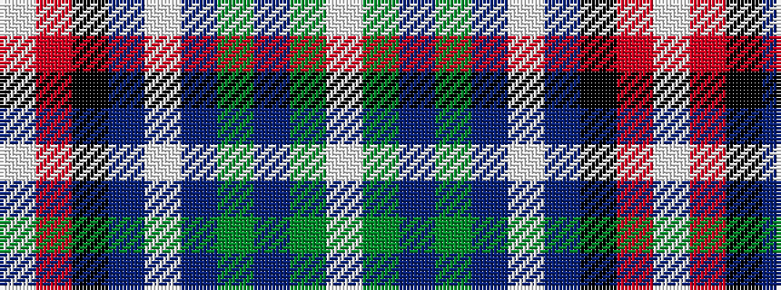

WGBGBWBKRW

It is a 10 stripe tartan.

<figure class="pat-woven">

<figcaption>idealised sample</figcaption>
</figure>

## Colour Sequence



## Tartans with this colour sequence

| Tartans |
|---------------|
| [Pilkington (2016)](/setts/s10/w2dg15db8dg2db32lb1db8k13r2lb1~x2/)|
||
