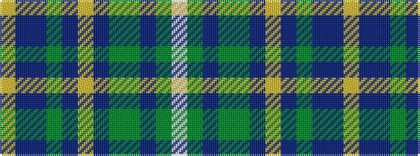

WGBGGBYBGBBY

It is a 12 stripe tartan.

<figure class="pat-woven">

<figcaption>idealised sample</figcaption>
</figure>

## Colour Sequence



## Tartans with this colour sequence

| Tartans |
|---------------|
| [Holroyd, John (Personal)](/setts/s12/w3g7db2g5y8db3lo3db3g3db12b21lo3~x2/)|
||
