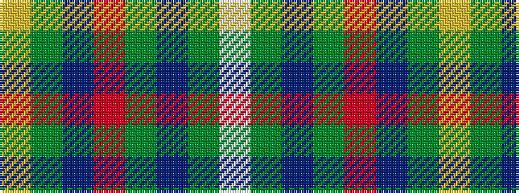

WGBGRBGY

It is a 8 stripe tartan.

<figure class="pat-woven">

<figcaption>idealised sample</figcaption>
</figure>

## Colour Sequence



## Tartans with this colour sequence

| Tartans |
|---------------|
| [Devon Rural Skills Trust](/variants/s8/w5y4b1y4r4b1dg4ly1~x2/)|
||
| [Devon Rural Skills Trust](/variants/s8/w5y4t1y4r4t1dg4ly1~x6/)|
||
