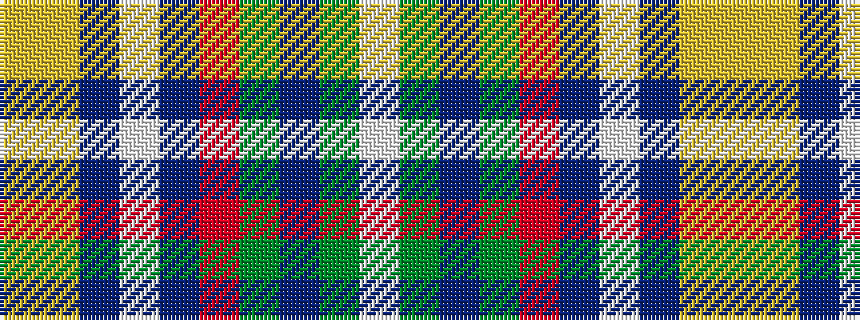

WGBGRBWBYY

It is a 10 stripe tartan.

<figure class="pat-woven">

<figcaption>idealised sample</figcaption>
</figure>

## Colour Sequence



## Tartans with this colour sequence

| Tartans |
|---------------|
| [State Seal of California (Fashion)](/variants/s10/lo29ly3b19lb3b3r3g17b3g4lb3~x2/)|
||
