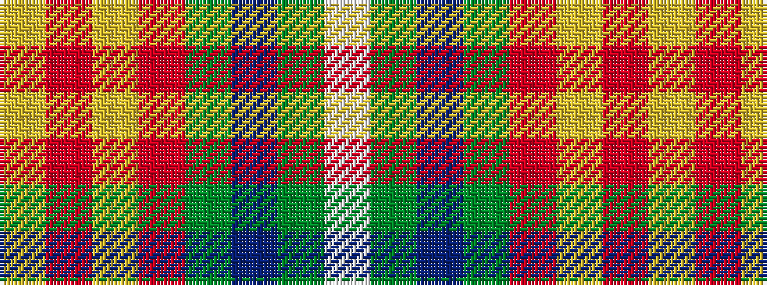

WGBGRYRY

It is a 8 stripe tartan.

<figure class="pat-woven">

<figcaption>idealised sample</figcaption>
</figure>

## Colour Sequence



## Tartans with this colour sequence

| Tartans |
|---------------|
| [Muskoka (District)](/variants/s8/w2g5t10g20r1ly2ri2ly1~x2/)|
||
| [Muskoka Canadian Tartan](/variants/s8/w4g10t24g42r3ly4ri4ly2/)|
||
