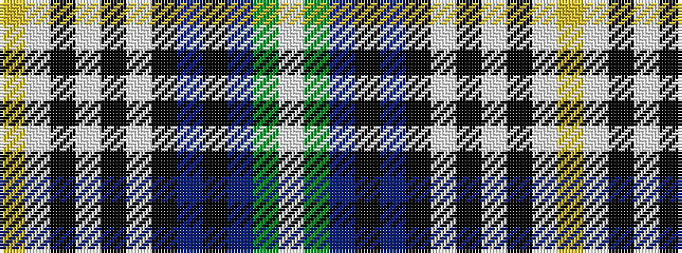

WGBKBKWKWKWY

It is a 12 stripe tartan.

<figure class="pat-woven">

<figcaption>idealised sample</figcaption>
</figure>

## Colour Sequence



## Tartans with this colour sequence

| Tartans |
|---------------|
| [MacDowall](/setts/s12/w3g14n3k7n48k7w3k3w3k3w12ly3~x2/)|
||
