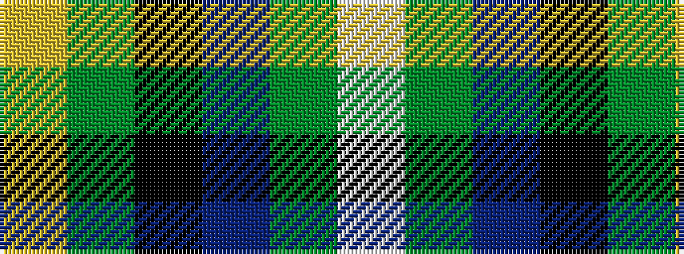

WGBKGY

It is a 6 stripe tartan.

<figure class="pat-woven">

<figcaption>idealised sample</figcaption>
</figure>

## Colour Sequence



## Tartans with this colour sequence

| Tartans |
|---------------|
| [Morris of Balgonie Htg (Personal)](/setts/s6/ly2dy20k10db3dg20lb2~x2/)|
||
