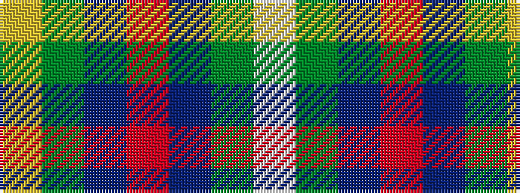

WGBRBGY

It is a 7 stripe tartan.

<figure class="pat-woven">

<figcaption>idealised sample</figcaption>
</figure>

## Colour Sequence



## Tartans with this colour sequence

| Tartans |
|---------------|
| [Nimah, Carissa & Bassem (Personal)](/setts/s7/w50g15db10r2db10g8ly3~x2/)|
||
