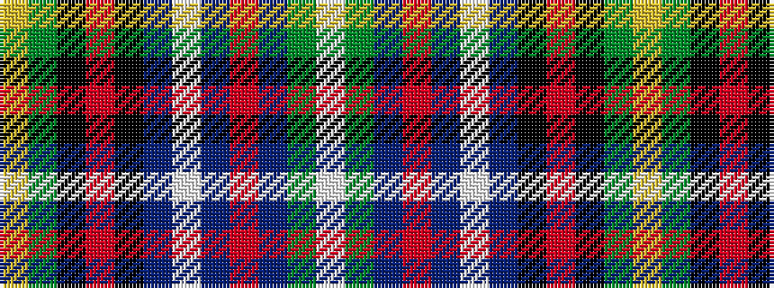

WGBRBWBKRKGY

It is a 12 stripe tartan.

<figure class="pat-woven">

<figcaption>idealised sample</figcaption>
</figure>

## Colour Sequence



## Tartans with this colour sequence

| Tartans |
|---------------|
| [Sedge, Douglas (Personal)](/setts/s12/w2g3dt2r1dt42lt1dt3k9r1k2g3lo2~x2/)|
||
