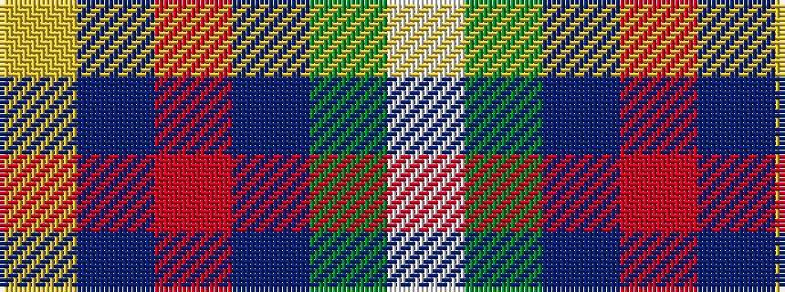

WGBRBY

It is a 6 stripe tartan.

<figure class="pat-woven">

<figcaption>idealised sample</figcaption>
</figure>

## Colour Sequence



## Tartans with this colour sequence

| Tartans |
|---------------|
| [Afternoon Tea / Darjeeling](/variants/s6/w15dg98dt72r25dt8ly15/)|
||
| [Afternoon Tea / Darjeeling](/variants/s6/w15y98db72r25db8ly15/)|
||
| [MacIntyre, Inglis](/variants/s6/w4g28db18r4db18ly3~x2/)|
||
