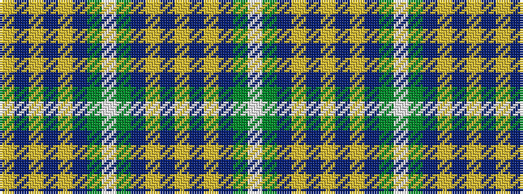

WGBYBYBYBGWGBYBYBY

It is a 18 stripe tartan.

<figure class="pat-woven">

<figcaption>idealised sample</figcaption>
</figure>

## Colour Sequence



## Tartans with this colour sequence

| Tartans |
|---------------|
| [Lamont Heather](/setts/s18/lo18do3lo3do3lo3do16y16w3y16do16lo17do3lo3do3lo17do16y16w3~x2/)|
||
