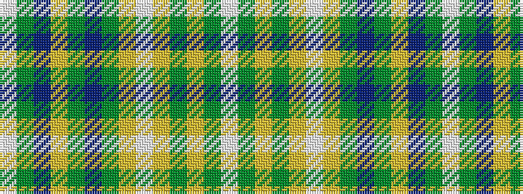

WGBYGBGYWYGYGW

It is a 14 stripe tartan.

<figure class="pat-woven">

<figcaption>idealised sample</figcaption>
</figure>

## Colour Sequence



## Tartans with this colour sequence

| Tartans |
|---------------|
| [Arbutus](/setts/s14/w40dg3lo6dg2lo2w2lo2dg10do2dg2lo2do2dg3w2~x2/)|
||
