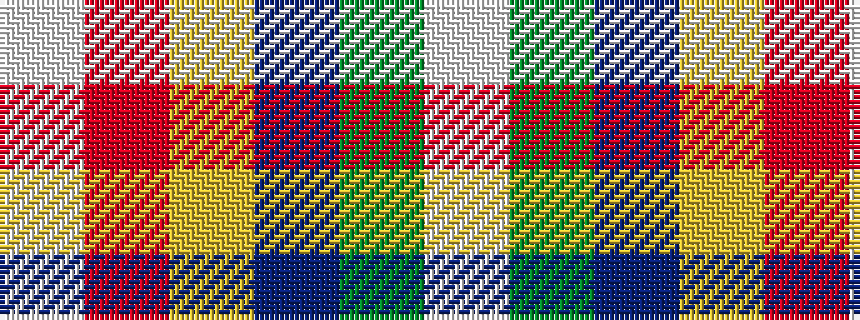

WGBYRW

It is a 6 stripe tartan.

<figure class="pat-woven">

<figcaption>idealised sample</figcaption>
</figure>

## Colour Sequence



## Tartans with this colour sequence

| Tartans |
|---------------|
| [Glencross (Moniaive) (Personal)](/setts/s6/w2o45lo3dt8dg8w2~x2/)|
||
