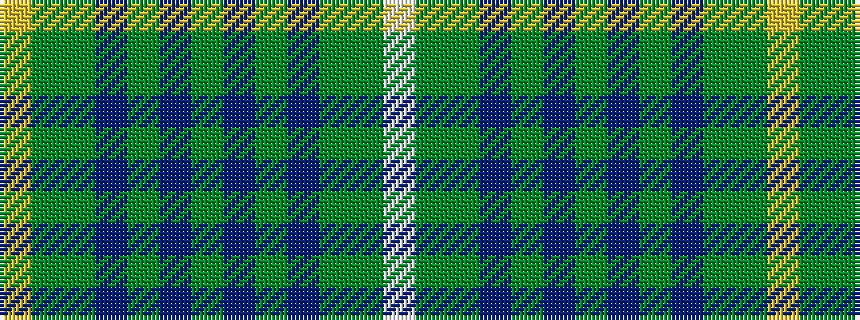

WGGBGBGBGBGGY

It is a 13 stripe tartan.

<figure class="pat-woven">

<figcaption>idealised sample</figcaption>
</figure>

## Colour Sequence



## Tartans with this colour sequence

| Tartans |
|---------------|
| [Crosby (Personal)](/setts/s13/lo1dg6dgi2p2dgi2dr6dgi1dr6dgi2p2dgi2dg6lb1~x6/)|
||
