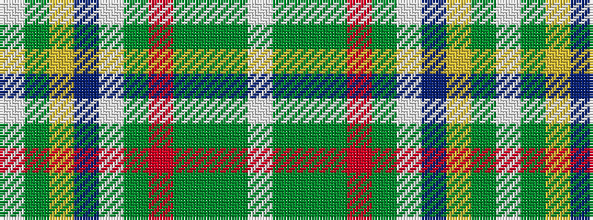

WGGGRGWBYGW

It is a 11 stripe tartan.

<figure class="pat-woven">

<figcaption>idealised sample</figcaption>
</figure>

## Colour Sequence



## Tartans with this colour sequence

| Tartans |
|---------------|
| [Stewart Blue Dress Clan Tartan Tartan Number: 1794. Earliest known date: 1977 May have originated at Peter MacArthurs in the 1970s, but was very popular at Kinloch Andersons shop in Leith. Information from Colin Hutcheson. See products available Copyright © Blair Urquhart, Comrie, 2015](/setts/s11/w72y20ly2db3w2y3o16dy6y2dy5w2~x2/)|
||
