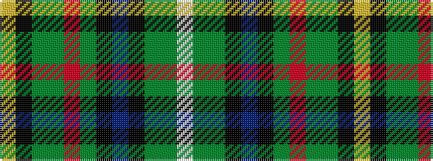

WGGKBKGRGGKY

It is a 12 stripe tartan.

<figure class="pat-woven">

<figcaption>idealised sample</figcaption>
</figure>

## Colour Sequence



## Tartans with this colour sequence

| Tartans |
|---------------|
| [Walsh](/variants/s12/w1g12dg1k2b2k1dg16r1dg16g1k1ly1~x2/)|
||
