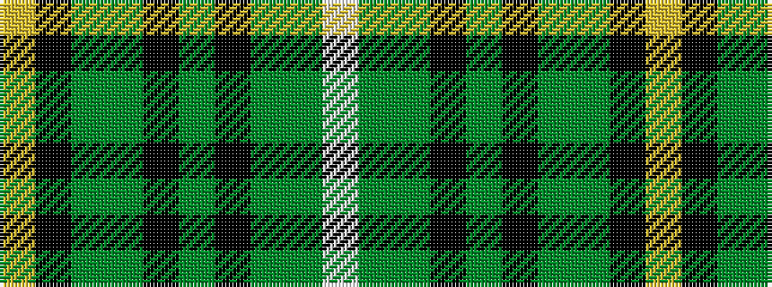

WGGKGKGGKY

It is a 10 stripe tartan.

<figure class="pat-woven">

<figcaption>idealised sample</figcaption>
</figure>

## Colour Sequence



## Tartans with this colour sequence

| Tartans |
|---------------|
| [Celtic F.C.](/setts/s10/w1gi10g1k2g2k1g30gi1k1ly1~x2/)|
||
| [Celtic F.C. Corporate Tartan Tartan Number: 2080. Earliest known date: 1989 Launched at Parkhead on November 30th 1989 by Billy McNeil. The tartan appeared the following year at the World Cup finals in Italy. See products available Copyright © Blair Urquhart, Comrie, 2015](/setts/s10/w1g10gi1k2gi2k1gi30g1k1ly1~x2/)|
||
