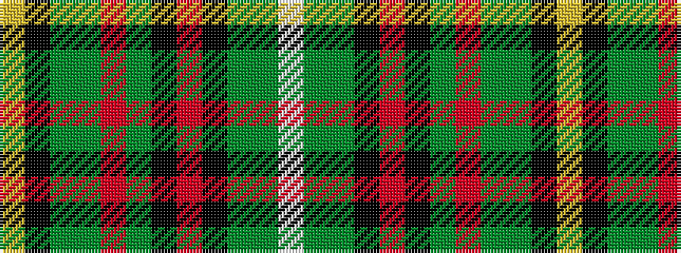

WGGKRKGRGGKY

It is a 12 stripe tartan.

<figure class="pat-woven">

<figcaption>idealised sample</figcaption>
</figure>

## Colour Sequence



## Tartans with this colour sequence

| Tartans |
|---------------|
| [Walsh (Name)](/setts/s12/w1g12gi1k2m2k1gi16r1gi16g1k1ly1~x2/)|
||
