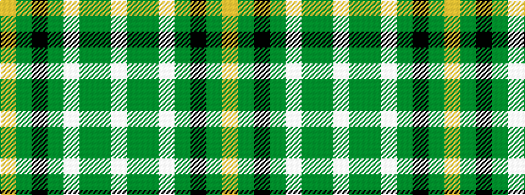

WGGWGKGY

It is a 8 stripe tartan.

<figure class="pat-woven">

<figcaption>idealised sample</figcaption>
</figure>

## Colour Sequence



## Tartans with this colour sequence

| Tartans |
|---------------|
| [New World Irish (Fashion)](/variants/s8/w9dg2g2w3g18k2dg33lo2~x2/)|
||
