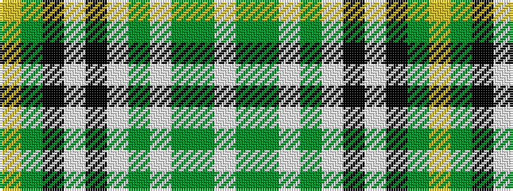

WGGWGWKWKGY

It is a 11 stripe tartan.

<figure class="pat-woven">

<figcaption>idealised sample</figcaption>
</figure>

## Colour Sequence



## Tartans with this colour sequence

| Tartans |
|---------------|
| [New World Irish](/setts/s11/w9g2g2w3g18w2k2w1k19g33lo2~x2/)|
||
