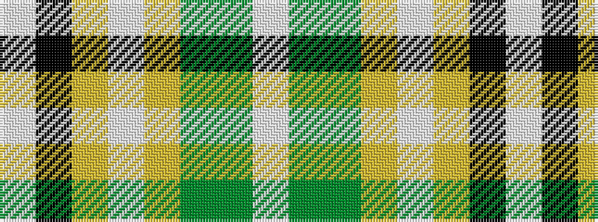

WGGYWYKW

It is a 8 stripe tartan.

<figure class="pat-woven">

<figcaption>idealised sample</figcaption>
</figure>

## Colour Sequence



## Tartans with this colour sequence

| Tartans |
|---------------|
| [Pavelka Limited](/setts/s8/w3k48lo5w3lo3g2g5lt3~x2/)|
||
