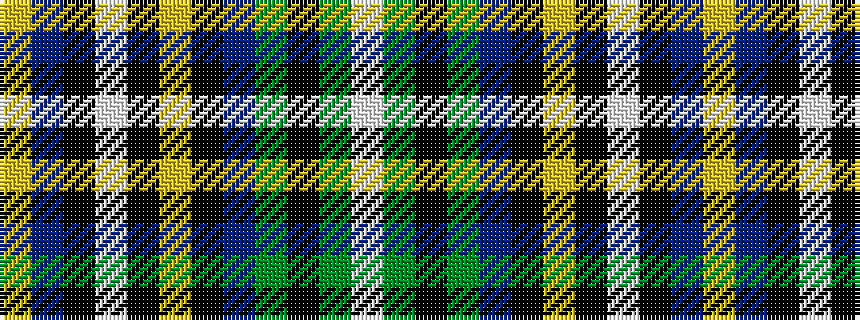

WGKGBKYKWKBY

It is a 12 stripe tartan.

<figure class="pat-woven">

<figcaption>idealised sample</figcaption>
</figure>

## Colour Sequence



## Tartans with this colour sequence

| Tartans |
|---------------|
| [O'Sheehan](/variants/s12/w2g2k2g6db4k2ly2k2w2k4db17ly2~x2/)|
||
