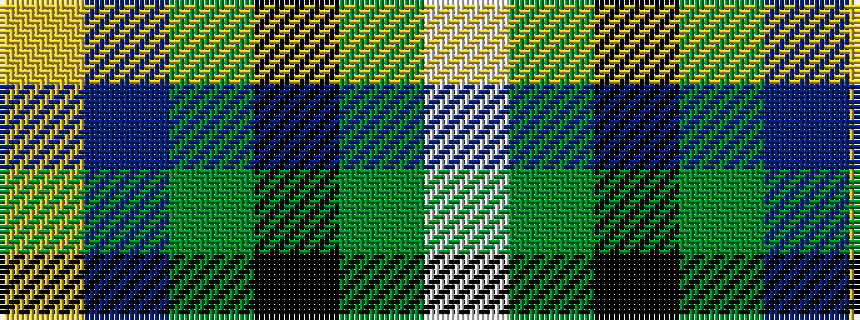

WGKGBY

It is a 6 stripe tartan.

<figure class="pat-woven">

<figcaption>idealised sample</figcaption>
</figure>

## Colour Sequence



## Tartans with this colour sequence

| Tartans |
|---------------|
| [Widows Sons Scotland Dress](/setts/s6/lb12dg16k12dg24dp75lo4/)|
||
| [Widows Sons Scotland Dress](/setts/s6/lb12g12k12g24dp75ly4/)|
||
