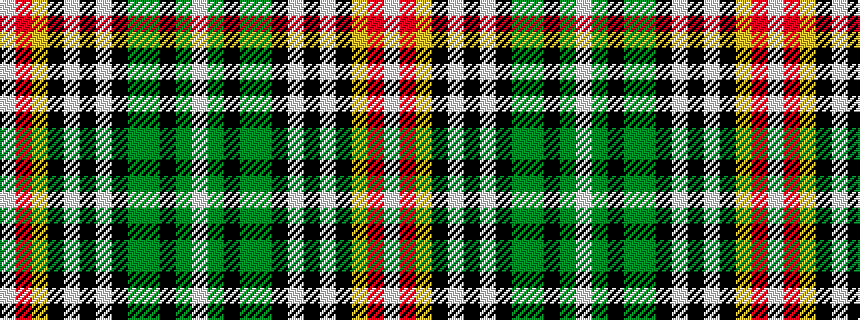

WGKGGKWKWKYRW

It is a 13 stripe tartan.

<figure class="pat-woven">

<figcaption>idealised sample</figcaption>
</figure>

## Colour Sequence



## Tartans with this colour sequence

| Tartans |
|---------------|
| [O'Farrell](/variants/s13/w2o14ly3k6w2k2w2k2g8y6k2y3w1~x2/)|
||
