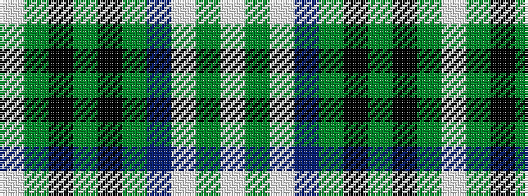

WGKGKGBWGW

It is a 10 stripe tartan.

<figure class="pat-woven">

<figcaption>idealised sample</figcaption>
</figure>

## Colour Sequence



## Tartans with this colour sequence

| Tartans |
|---------------|
| [Elsa Dance](/variants/s10/w8g6w44db10gi6k3gi4k3gi34w4/)|
||
