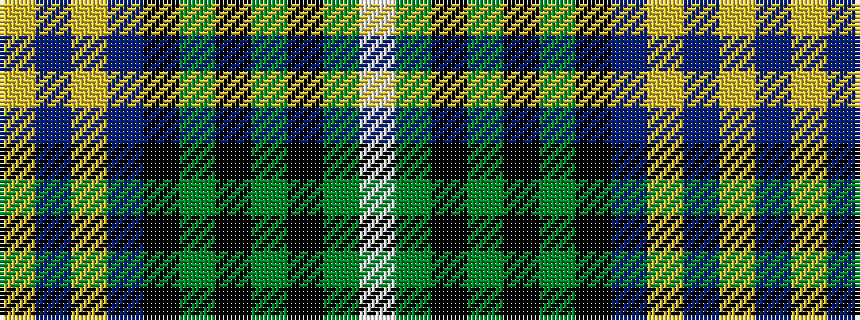

WGKGKGKBYBY

It is a 11 stripe tartan.

<figure class="pat-woven">

<figcaption>idealised sample</figcaption>
</figure>

## Colour Sequence



## Tartans with this colour sequence

| Tartans |
|---------------|
| [Clark of Ulva (Clan)](/setts/s11/lt3dg3k4dg14k4dg3k14db18lo1db4lo2~x2/)|
||
