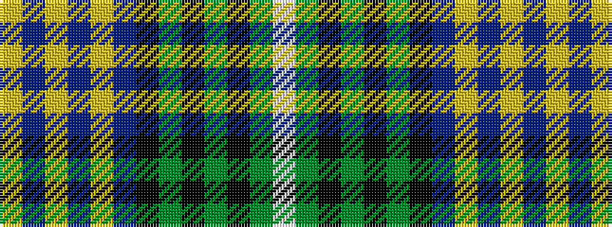

WGKGKGKBYBYBY

It is a 13 stripe tartan.

<figure class="pat-woven">

<figcaption>idealised sample</figcaption>
</figure>

## Colour Sequence



## Tartans with this colour sequence

| Tartans |
|---------------|
| [Clerke of Ulva](/setts/s13/lt3dg3k4dg14k4dg3k14db18lo1db4lo2db4lo1~x2/)|
||
