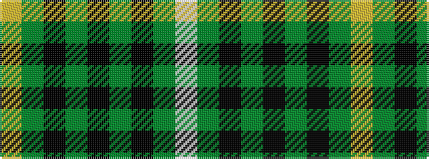

WGKGKGKGY

It is a 9 stripe tartan.

<figure class="pat-woven">

<figcaption>idealised sample</figcaption>
</figure>

## Colour Sequence



## Tartans with this colour sequence

| Tartans |
|---------------|
| [MacIver Hunting](/variants/s9/w2g12k3g3k16g3k3g12ly2~x2/)|
||
| [MacIver hunting](/variants/s9/w3g27k5g5k32g5k5g27ly3~x2/)|
||
