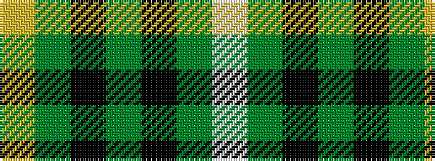

WGKGKGY

It is a 7 stripe tartan.

<figure class="pat-woven">

<figcaption>idealised sample</figcaption>
</figure>

## Colour Sequence



## Tartans with this colour sequence

| Tartans |
|---------------|
| [Cornish Brewery, Green](/setts/s7/ly3dg24ki11dg3k10dg3w2~x2/)|
||
