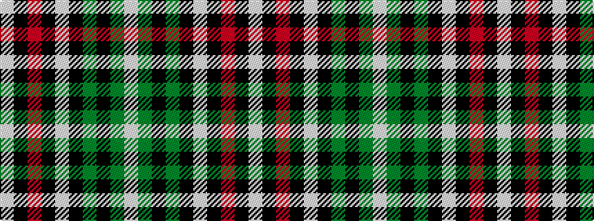

WGKGKWKRKW

It is a 10 stripe tartan.

<figure class="pat-woven">

<figcaption>idealised sample</figcaption>
</figure>

## Colour Sequence



## Tartans with this colour sequence

| Tartans |
|---------------|
| [Unidentified #49](/variants/s10/lb16k4o1k2lb1k6dg6k1dg6lb1~x4/)|
||
