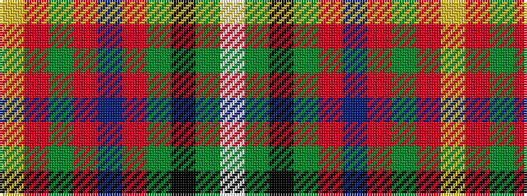

WGKGRBRGRY

It is a 10 stripe tartan.

<figure class="pat-woven">

<figcaption>idealised sample</figcaption>
</figure>

## Colour Sequence



## Tartans with this colour sequence

| Tartans |
|---------------|
| [Hello Kitty Red](/setts/s10/w2dy4k6dy6r2b3r21dy3r3ly2~x2/)|
||
