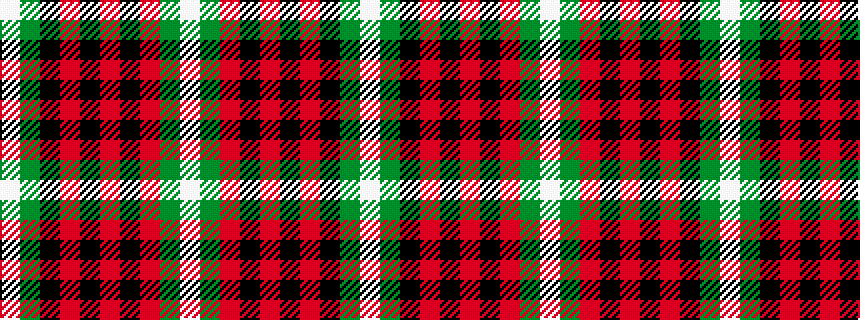

WGKRKRKRGW

It is a 10 stripe tartan.

<figure class="pat-woven">

<figcaption>idealised sample</figcaption>
</figure>

## Colour Sequence



## Tartans with this colour sequence

| Tartans |
|---------------|
| [Kiernan](/variants/s10/w2g4k6r2k2r2k3r2g20w1~x2/)|
||
