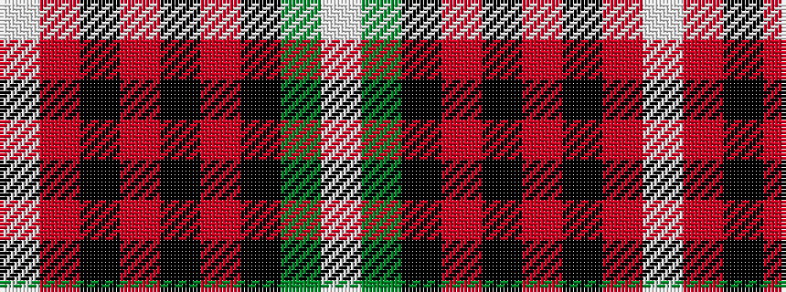

WGKRKRKRW

It is a 9 stripe tartan.

<figure class="pat-woven">

<figcaption>idealised sample</figcaption>
</figure>

## Colour Sequence



## Tartans with this colour sequence

| Tartans |
|---------------|
| [O'Neill (District)](/setts/s9/lb2r12k4r2k2r2k6g5lb2~x2/)|
||
